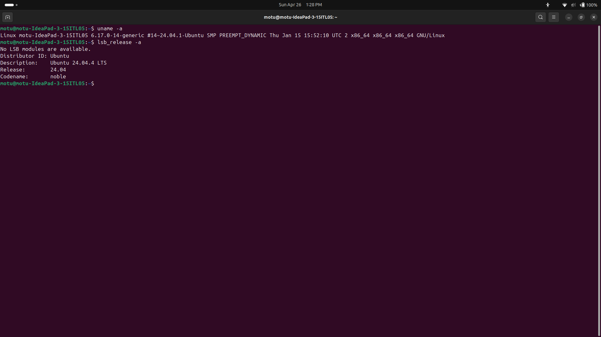

# Ubuntu Dual Boot Guide & Essential Commands

This repository serves as a quick reference guide on how to set up an Ubuntu dual boot alongside Windows, along with some essential Linux commands I use for development and system management.

## 1. Dual Booting Ubuntu: A Quick Guide

Setting up a dual boot gives you the standard utility of Windows while providing a powerful, native Linux environment for coding and security tools. Here is the general process I follow for a clean setup:

1. **Create Unallocated Space:** In Windows, open "Disk Management" and shrink an existing volume (usually the `C:` drive) to free up at least 30-50 GB of unallocated space.
2. **Prepare a Bootable USB:** Download the Ubuntu ISO from the official website. Use a tool like Rufus or BalenaEtcher to flash the ISO onto a USB flash drive (8GB or larger).
3. **Boot from USB:** Restart the computer, enter the BIOS/UEFI settings (usually by pressing F2, F10, F12, or Del during startup), and change the boot priority to boot from the USB drive first.
4. **Installation:** Select "Install Ubuntu" from the initial menu. Follow the on-screen instructions. When prompted for the installation type, choose "Install Ubuntu alongside Windows Boot Manager" to automatically utilize the unallocated space. (Alternatively, choose "Something else" to manually map your root `/` and swap partitions).
5. **Finalize:** Complete the region and user setup, finish the installation, remove the USB drive, and restart. The GRUB bootloader will now appear on startup, allowing you to select your OS.

### Setup Verification
Here is a screenshot of my local environment running successfully after completing this installation process, verifying the system architecture:

---

## 2. Essential Linux Commands & Personal Notes

Once the system is up and running, these are the terminal commands I find myself using constantly to navigate and manage packages:

### `sudo apt update && sudo apt upgrade`
* **Usage:** Updates the local package index and then upgrades all installed packages to their latest versions.
* **My Notes:** This is always the very first thing I run after a fresh install or when booting up for the day. Chaining them with `&&` ensures the upgrade only triggers if the update succeeds, keeping the environment secure.

### `ls -la`
* **Usage:** Lists all files and directories in the current location, including hidden files, formatted as a detailed list.
* **My Notes:** The `-a` flag is critical here because it reveals hidden configuration files (like `.bashrc`, `.profile`, or `.env` files) that standard GUI file managers usually hide by default.

### `mkdir -p`
* **Usage:** Creates new directories, and the `-p` flag automatically creates any missing parent directories in the path.
* **My Notes:** Instead of creating folders one by one, a command like `mkdir -p project/backend/src/controllers` lets me build an entire directory tree for a new web project in a single keystroke.

### `grep`
* **Usage:** Searches for specific text patterns within files or terminal output.
* **My Notes:** I heavily rely on `grep` when debugging code or inspecting system logs. Instead of reading through massive outputs manually, I can pipe data to it (e.g., `cat /var/log/syslog | grep "error"`) to instantly isolate issues.

### `chmod +x`
* **Usage:** Modifies file permissions to grant execute rights to a file.
* **My Notes:** Whenever I write a custom bash script for automating tasks, Linux prevents it from running by default due to security restrictions. Running `chmod +x scriptname.sh` is the mandatory step to make my scripts executable.
